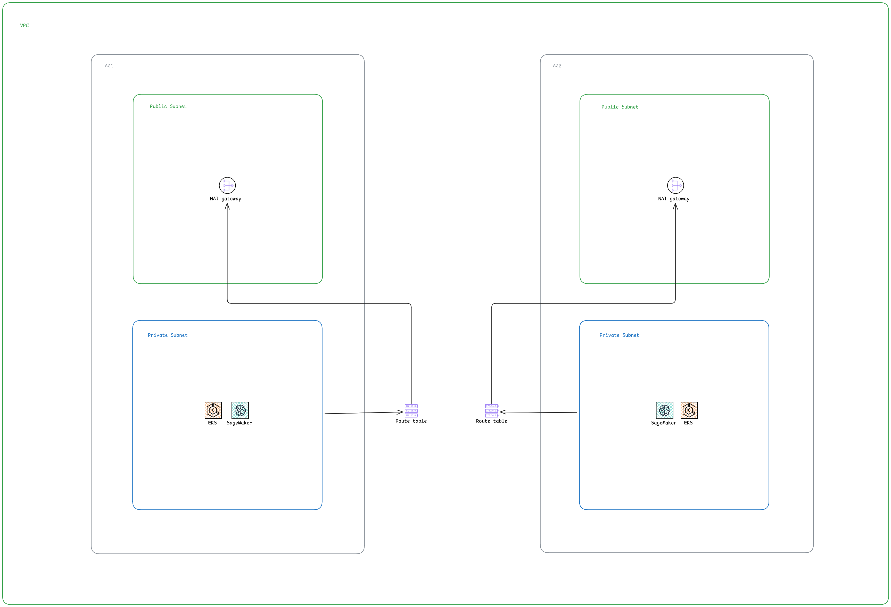

# Infra (Infrastructure as Code)

This repository contains Terraform configurations for deploying AWS infrastructure, including a VPC with multi-AZ networking and an Amazon Auto Mode EKS (Elastic Kubernetes Service) cluster.

## Overview

This infrastructure setup provides:
- **Network Layer**: Multi-AZ VPC with public and private subnets, NAT gateways, and route tables
- **Compute Layer**: Auto Mode EKS cluster with IAM roles.

## Architecture



The infrastructure is organized into two main layers:

### Network Layer (VPC Module)
- **Public Subnets**: 2 subnets (1 per availability zone) for internet-facing resources
- **Private Subnets**: 2 subnets (1 per availability zone) for application workloads
- **NAT Gateways**: 2 NAT gateways (1 per AZ) for outbound internet access from private subnets
- **Route Tables**: Separate route tables for private subnets with NAT gateway routing
- **Kubernetes Tags**: Subnets are tagged for Kubernetes ELB integration

### Compute Layer (EKS Module)
- **EKS Cluster**: Auto Mode Kubernetes cluster
- **IAM Roles**: Separate roles for cluster and node pool with required AWS policies
- **Features**:
  - Block storage enabled
  - Elastic Load Balancing enabled
  - Private and public API endpoint access
  - Bootstrap self-managed addons disabled

## Prerequisites

- [Terraform](https://www.terraform.io/downloads) >= 1.12
- AWS CLI configured with appropriate credentials
- Access to the existing VPC specified in `terraform.tfvars`
- Access to the S3 bucket for Terraform state backend (`ct-s3-state-backend`)

## Usage

### Initialize Terraform
```bash
terraform init \
  -backend-config="bucket=ct-s3-state-backend" \
  -backend-config="key=infra-terraform.tfstate" \
  -backend-config="region=eu-west-3"
```

### Plan Changes

```bash
terraform plan
```

### Apply Configuration

```bash
terraform apply
```

### Destroy Infrastructure

```bash
terraform destroy
```

## Notes

- Public subnets use the default VPC main routing table
- The infrastructure uses an **existing VPC**
- EKS cluster uses **API authentication mode** with bootstrap cluster creator admin permissions enabled
- Subnets are tagged for Kubernetes integration (`kubernetes.io/role/elb` and `kubernetes.io/role/internal-elb`)
- NAT gateways are created in public subnets to provide internet access for private subnets
- **AWS Load Balancer Controller** is automatically installed